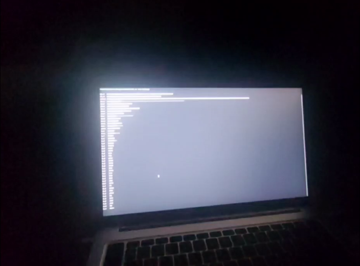

# cmdviz
Speakers/microphone output visualization in terminal.



## Usage
```bash
uv run main.py
```
Bars will automatically fit to terminal dimensions.
Additional configuration can be set in `main.py` constants:

 - `USE_MIC`: Use microphone output (speakers otherwise)
 - `MIN_HZ`: Min volume to capture (in Hz)
 - `MAX_HZ`: Max volume to capture (in Hz)
 - `BLOCKSIZE`: Record block size. Higher = more accurate but lower FPS and more CPU usage
 - `SAMPLERATE`: Record samplerate (obvious)
 - `MAX_VOLUME`: Maximum possible volume (to fit volume in terminal width)
 - `BANDS_LOGARIPHMIC`: Use logariphm to build bars (linear otherwise)

\#   | linear | logariphmic
----|--------|-------------
1 | 15Hz - 415Hz        | 15Hz - 18Hz
2 | 415Hz - 815Hz       | 18Hz - 21Hz
3 | 1215Hz - 1615Hz     | 21Hz - 25Hz
... |                   |
15 | 14815Hz - 15215Hz  | 11290Hz - 13440Hz
16 | 15215 - 15615Hz    | 13440Hz - 16000Hz
